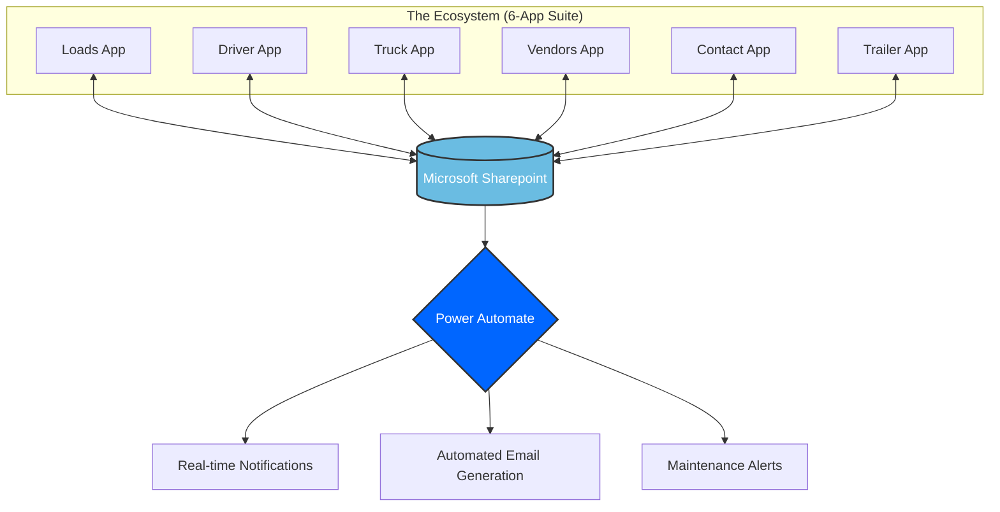

# 📦 US Logistics Ecosystem
### A Comprehensive 6-App Suite for End-to-End Shipping Orchestration

This project represents a full-scale digital transformation for a logistics enterprise in the United States. I designed and developed an interconnected ecosystem of **6 custom applications** that centralize fragmented shipping data into a single source of truth.

---

## 🏗 The Architecture (The 6-App Suite)

The challenge was to connect different departments (Warehouse, Drivers, Managers, and Clients). The solution was broken down into specialized modules:

| App | Target User | Purpose & Key Functionality |
| :--- | :--- | :--- |
| **Loads** | Dispatchers/Ops | Comprehensive load management, including tracking and the creation of new cargo entries. |
| **Driver** | Fleet Managers | Full control over driver profiles and digital storage for driver-specific compliance documents. |
| **Truck** | Fleet/Maintenance | Management of the truck fleet, including document tracking and scheduling of required maintenance. |
| **Vendors** | Admin/Procurement | Centralized directory for registered companies (Shipper, Receiver, Vendor, Contractor, and Client). |
| **Contact** | Communication | Management of point-of-contacts for registered vendors, suppliers, and responsible staff. |
| **Trailer** | Fleet/Maintenance | Tracking of company trailers, including document management and required maintenance logs. |

---

## 📊 System Architecture Diagram
> **Note:** The diagram below is rendered automatically by GitHub using Mermaid.

---

## 🚀 Key Features & Innovations

* **Unified Data Core:** All 6 apps communicate via **Dataverse**, ensuring zero data silos.
* **Automated Workflow Engine:** Over 15+ **Power Automate** flows handling instant notifications, PDF generation (Invoices/BOL), and status triggers.
* **Offline-Ready:** The Driver Hub was built to handle data entry in areas with poor cellular coverage, syncing automatically once back online.
* **Cross-Border Compliance:** Integrated logic to handle US-specific logistics regulations and time zones.

---

## 🛠 Tech Stack

* **Frontend:** Power Apps (Canvas & Model-Driven)
* **Backend & Logic:** Power Automate (Cloud Flows)
* **Database:** Microsoft Dataverse / SharePoint Online
* **Analytics:** Power BI
* **Integrations:** Outlook (Notifications), OneDrive (Storage), and Custom Connectors.

---

## 📈 Business Impact

> "The implementation of this ecosystem reduced manual paperwork by 70% and increased dispatch efficiency by 40% within the first quarter."

* **Efficiency:** Eliminated manual Excel spreadsheets.
* **Transparency:** Real-time visibility for the end customer.
* **Scalability:** The system was designed to handle a 200% increase in load volume without performance loss.

---

## 📸 System Preview
*(Placeholder for Screenshots)*
> **Note:** Due to NDA (Non-Disclosure Agreement), some data in the screenshots has been blurred.

  

---

## 👤 Author
**Lucas Carvalho Santana**
*Power Platform Specialist*
* [LinkedIn](https://www.linkedin.com/in/lucas-carvalho-santana/)
* [Portfolio](https://github.com/lucas-crv)
